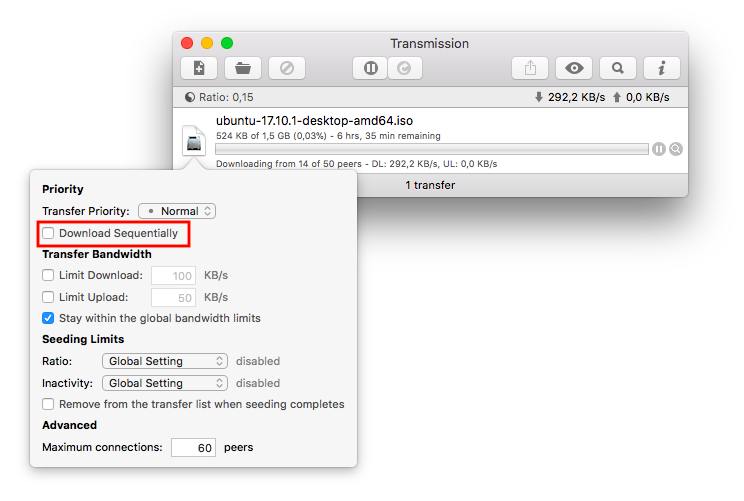
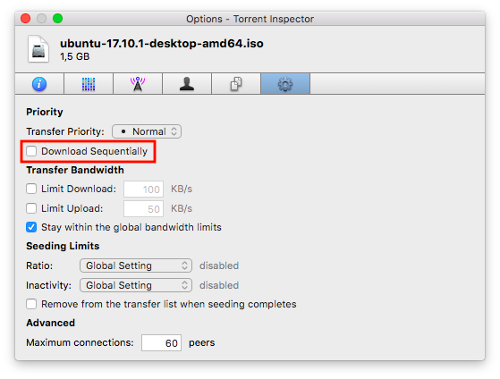
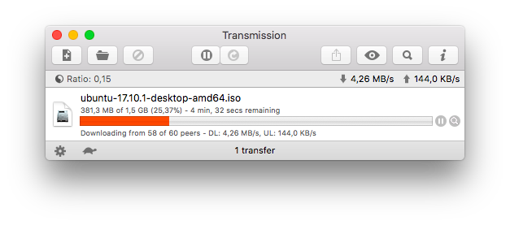
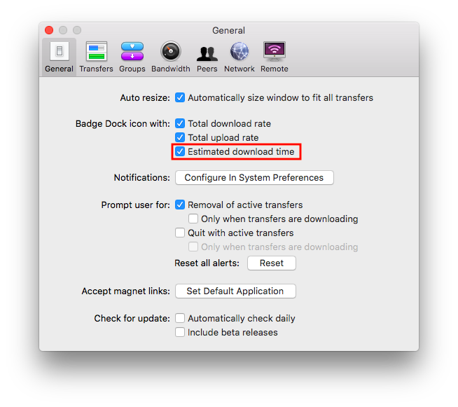

# Transmission with additional features

The features include:

- sequential downloading on macOS (Based on @midenok's work [transmission-patches](https://github.com/midenok-forks/transmission-patches))
- ETA badge for macOS Dock
  
## How to enable sequential downloading on macOS:
1. Click on the icon of the torrent you want to download sequentially.
2. Check the **Download Sequentially** checkbox from the pop-up menu.

Alternatively you can enable it by:
1. Right-click on the torrent you want to download sequentially.
2. Select the **Options** tab (Gear icon) in the **Torrent Inspector** window.
3. Check the **Download Sequentially** checkbox on the **Options** tab.

The progress bar of the selected torrent will turn to orange.

## How to disable the estimated download time badge on macOS:
1. Go to **Preferences**.
2. Uncheck the **Estimated download time** checkbox at the **Badge Dock icon with** section.

